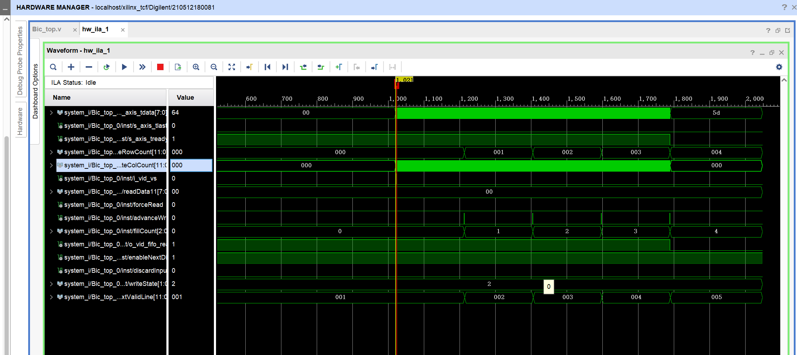
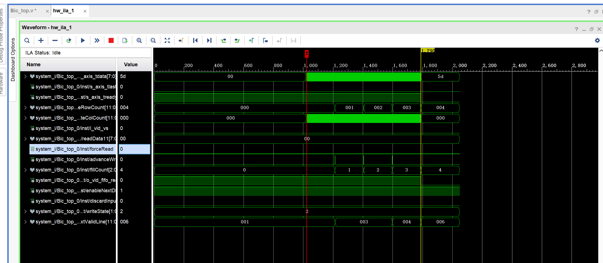

# 写逻辑问题
在放大比例为reg [SCALE_BITS-1:0]			      i_scaler_y_ratio=(1) * (1<<SCALE_FRAC_BITS)时

在放大比例为reg [SCALE_BITS-1:0]			      i_scaler_y_ratio=(1.5) * (1<<SCALE_FRAC_BITS)时

其实写逻辑还是比较复杂，但是核心
就是这四个

## s_axis_tvalid
这个数据是控制是否准备号接收数据

## o_vid_fifo_read
assign o_vid_fifo_read = (fillCount < BUFFER_SIZE) & enableNextDin;
他的这个“fillCount < BUFFER_SIZE”是防止是否溢出缓冲区

## enableNextDin
表示已经读完了。

## ！discardInput

主要是用来判断是否丢弃信号的，为0是不丢。意思是这一帧不要了